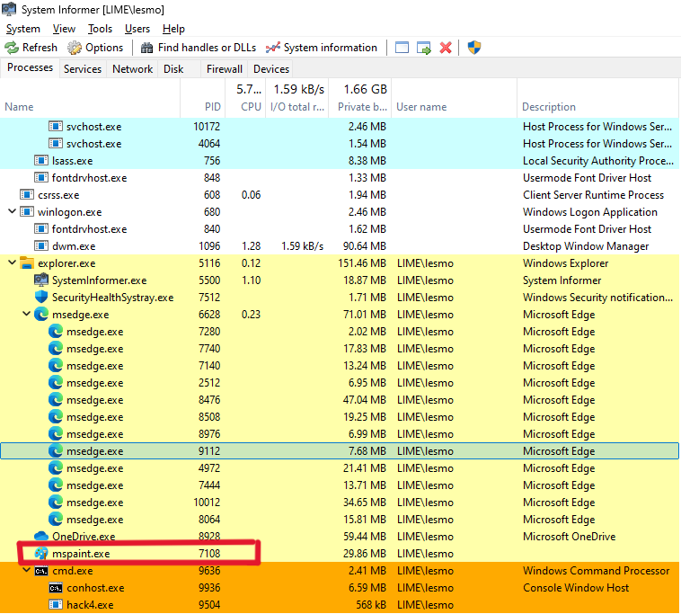

This chapter is practiced along with this repository https://github.com/PacktPublishing/Malware-Development-for-Ethical-Hackers/blob/main/chapter02/01-traditional-injection/evil.c.

### Note
I was failing to inject evil.dll for several times, there are seom methods I used for troubleshooting.

### Before Start
If you have the issue like this
```bash
x86_64-w64-mingw32-g++: command not found
```

You can install by doing so
```bash
sudo apt update
sudo apt install mingw-w64
x86_64-w64-mingw32-g++ --version
```
Now you can go for the fun part.

---

## Step-by-Step Troubleshooting and Fix
### 1. Verify the Compilation of the DLL
Ensure that `evil.dll` is compiled correctly and that it can be loaded into a process. Run the following command:

```bash
x86_64-w64-mingw32-g++ -shared -o evil.dll evil.c -fpermissive
```

### 2. Check DLL Path
Ensure the path to `evil.dll` is correct. It must match exactly as specified in hack3.c. In your `hack4.c` file, maliciousDLL is set to `C:\\evil.dll`. Ensure evil.dll is actually located in `C:\`.

You can change the path to be more flexible:

```c
char maliciousDLL[] = "C:\\path\\to\\evil.dll";
```
Update it to match the actual location of `evil.dll`.

### 3. Validate Process ID and Permissions
Make sure the process ID (PID) you are targeting is correct and that your application has the necessary permissions to open the target process and inject the DLL. In this case, I use `mspaint.exe` as the target for injection. PID is `7108`.




### 4. Compile the Injector Program
Ensure `hack4.c` is compiled correctly:

```bash
x86_64-w64-mingw32-g++ -O2 hack4.c -o hack4.exe -I/usr/share/mingw-w64/include/ -s -ffunction-sections -fdata-sections -Wno-write-strings -fno-exceptions -fmerge-all-constants -static-libstdc++ -static-libgcc -fpermissive
```
### Testing
- Compile both `evil.c` and `hack4.c`.
- Ensure `evil.dll` is in the correct path.
- Run `hack4.exe` with the correct PID of mspaint.exe in your Windows VM:

```bash
hack4.exe <PID>
```
- Check if the message box appears in the target application (mspaint.exe).

- I have added error handling in `hack4.c`, you'll be able to see any issues that occur during each step of the process, making it easier to identify what might be going wrong.

---

# Discovery
With powerful `Process Hacker`, it's clear that DLL has been injected into `mspaint.exe`.

