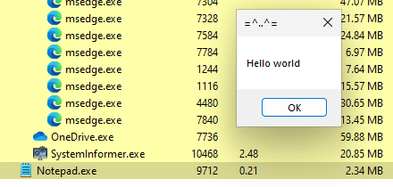

# APC Injection
**Asynchronous Procedure Call** (APC) Injection is a method used to inject malicious code into a running process. This technique leverages the Windows APC mechanism, which allows functions to be executed asynchronously in the context of a specific thread.

# Step 1
Compile `hack1.c`
```bash
x86_64-w64-mingw32-gcc hack1.c -o hack1.exe -s -ffunction-sections -fdata-sections -Wno-write-strings -fno-exceptions -fmerge-all-constants -static-libstdc++ -static-libgcc
```

# Step 2
Execute `hack1.exe` in Windows 11 VM, then open `Notepad.exe`, we will see the message jumps out.<br>


From here, I close the `Notepad.exe`, the malicious message box still remains.<br>


The thread of `Notepad.exe` is suspended.<br>


While the malicious one is still active.<br>


# How it works

The myPayload array contains the raw bytecode of the payload, which in this example, is designed to display a message box. <br>


The `CreateProcessA` function is used to create a new instance of `Notepad.exe` in a suspended state. <br>


Memory is allocated within the address space (empty buffer) of the target process `Notepad` via `VirtualAllocEx`. The `PAGE_EXECUTE_READWRITE` flag allows the allocated memory to be readable, writable, and executable.<br>


The `WriteProcessMemory` function copies the payload from the current process into the allocated memory of the target process.<br>


The `QueueUserAPC` function is used to queue an APC to the main thread of the target process. The function pointer (`apcRoutine`) points to the payload within the target process's memory.<br>


The ResumeThread function resumes the suspended thread, allowing the queued APC to execute. When the thread resumes, the APC executes the payload, in this case, displaying a message box.<br>


---
# References
- [QueueUserAPC ](https://docs.microsoft.com/en-us/windows/win32/api/processthreadsapi/nf-processthreadsapi-queueuserapc)
- [Original Source Code by @cocomelonc](https://github.com/PacktPublishing/Malware-Development-for-Ethical-Hackers/blob/main/chapter02/03-apc-injection/hack1.c)