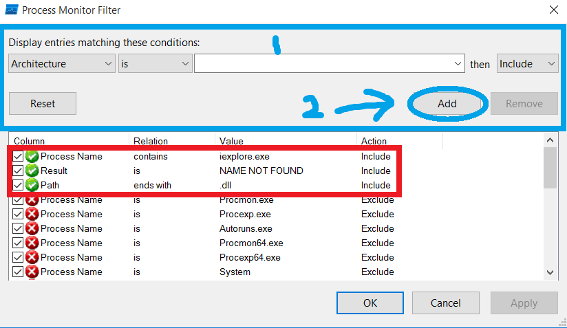
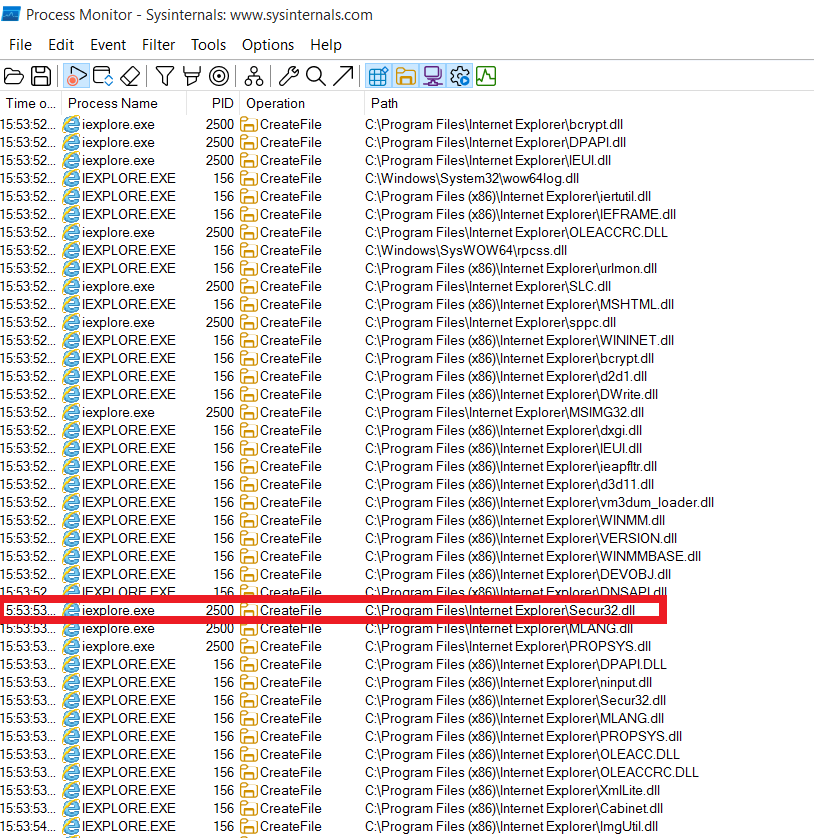
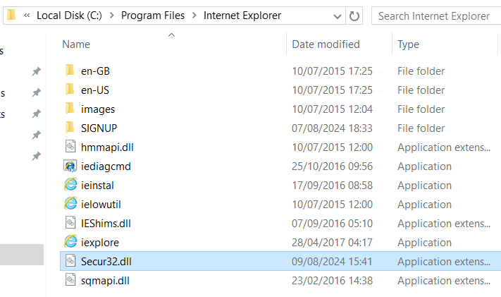
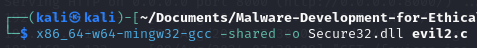
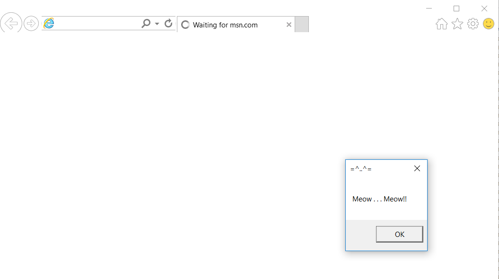
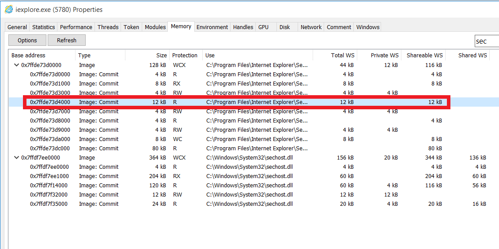

# What's DLL Search Order Hijacking for Presistence?
**DLL Search Order Hijacking** is a technique used by attackers to maintain persistence on a compromised system by exploiting the way Windows searches for **Dynamic Link Library (DLL)** files. This method allows malware to replace or inject malicious code into legitimate processes by tricking the system into loading a malicious DLL instead of the intended, legitimate one. <br>

## How DLL Search Order Hijacking Works
Windows uses a specific order to search for DLL files when an application requests them. The search order typically includes:

The directory from which the application is loaded.
The system directory (usually C:\Windows\System32).
The 16-bit system directory.
The Windows directory.
The current working directory.
Directories listed in the system PATH environment variable.
If an attacker can place a malicious DLL in a directory that is searched before the legitimate DLL's location, Windows will load the attacker's DLL instead. This effectively allows the attacker to execute arbitrary code whenever the targeted application runs. <br>

Example of DLL Search Order Hijacking for Persistence
One practical example of DLL search order hijacking involves targeting applications like Internet Explorer. While Internet Explorer may not be commonly used by most individuals today, it often remains installed on many Windows systems due to legacy support. Attackers can exploit this by placing a malicious DLL in a location where Internet Explorer will load it during startup. This ensures that the malicious code is executed every time Internet Explorer is launched, providing a persistent foothold on the system. <br>

# Why Internet Explorer is a Common Target
- **Legacy Presence:** Despite being largely obsolete, Internet Explorer is still present on many systems, making it a viable target for attackers. <br>
- **Low User Interaction:** Because most users no longer actively use Internet Explorer, they are less likely to notice any anomalies or remove the application, allowing the malware to remain undetected for longer periods. <br>
- **System Privileges:** Internet Explorer often runs with significant privileges, which can be leveraged by the malicious DLL to perform various malicious activities. <br>

---

# Step 1. Find the potential vulnerable `.dll`
- Windows 10 VM
- Download [Procmon](https://learn.microsoft.com/en-us/sysinternals/downloads/procmon) and open it. <br>
- Set up the filter as shown within the red square. You can add the conditions in the area with blue square. <br>


# Step 2. Compile `evil2.c`

```bash
x86_64-w64-mingw32-gcc -shared -o evil2.dll evil2.c
```


I didn't find the effective `.dll` file at first. After trying several files few times, I found `Secure32.dll` works for me. <br>


Rename `evil2.dll` to `Secure32.dll`, and put `Secure32.dll` in the folder as shown in `Procmon`. <br>
```
C:\Program Files\Internet Explorer
```


Restart `Internet Exporer`. <br>




Open the `Process Hacker` (or called as `System Informer`). <br>




---

# Mitigation Strategies
1. **Use Safe DLL Search Mode:** Enable the safe DLL search mode to alter the search order and prioritize system directories, making it harder for attackers to hijack the search order.
2. **Implement Application Whitelisting:** Restrict the loading of DLLs to only those that are explicitly allowed, reducing the risk of unauthorized DLLs being executed.
3. **Monitor File Integrity:** Implement file integrity monitoring to detect unauthorized changes to DLL files or the introduction of new DLLs in critical directories.
4. **Regularly Update and Patch Systems:** Ensure all software, including rarely used applications like Internet Explorer, is regularly updated and patched to mitigate known vulnerabilities.


---

# References
- Microsoft Docs (2023) Dynamic-Link Library Search Order. Available from: https://learn.microsoft.com/en-us/windows/win32/dlls/dynamic-link-library-search-order [Accessed 9 August 2024].


