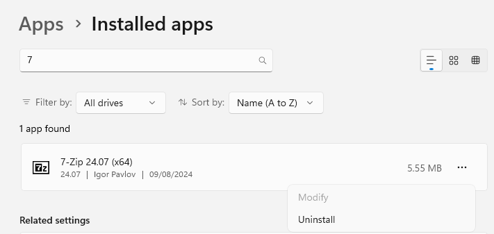
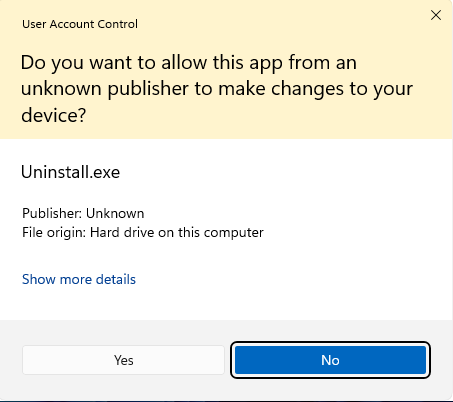
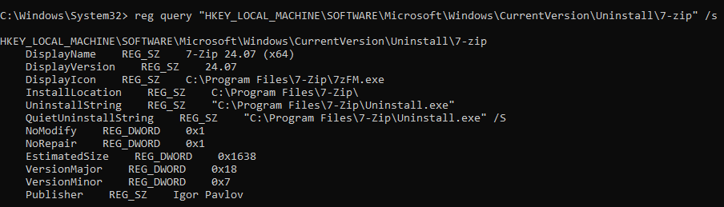
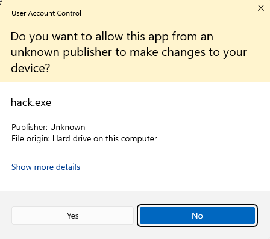
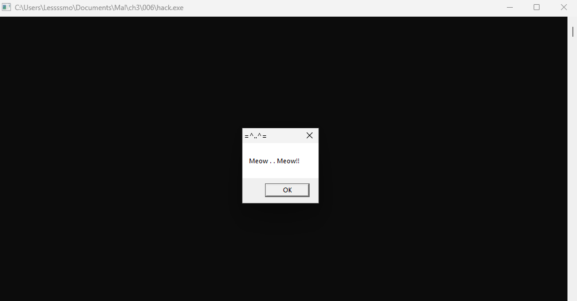

# Info
23


---

# Step 1. 

```bash
x86_64-w64-mingw32-g++ -O2 hack.c -o hack.exe -I/usr/share/mingw-w64/include/ -s -ffunction-sections -fdata-sections -Wno-write-strings -fno-exceptions -fmerge-all-constants -static-libstdc++ -static-libgcc -fpermissive

```


Click on `No`. <br>


```bash
 reg query "HKEY_LOCAL_MACHINE\SOFTWARE\Microsoft\Windows\CurrentVersion\Uninstall\7-zip" /s
```


# Step 2. `pers.c`

```bash
x86_64-w64-mingw32-g++ -O2 pers.c -o pers.exe -I/usr/share/mingw-w64/include/ -s -ffunction-sections -fdata-sections -Wno-write-strings -fno-exceptions -fmerge-all-constants -static-libstdc++ -static-libgcc -fpermissive
```
And then run `pers.c`. <br>

```powershell
.\pers.exe
```

# Step 3. Restart the VM
Uninstall `7-zip` again. Then `hack.exe` will pop up. <br>


Compare with the `User Account Control` popped out previously, this time it is `hack.exe`.

---

# References
- []()