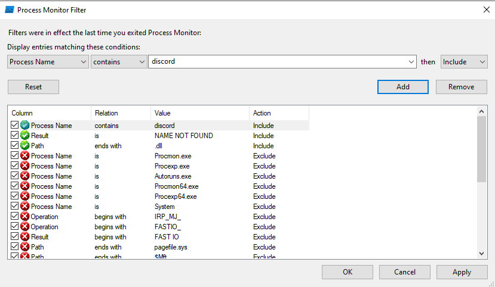
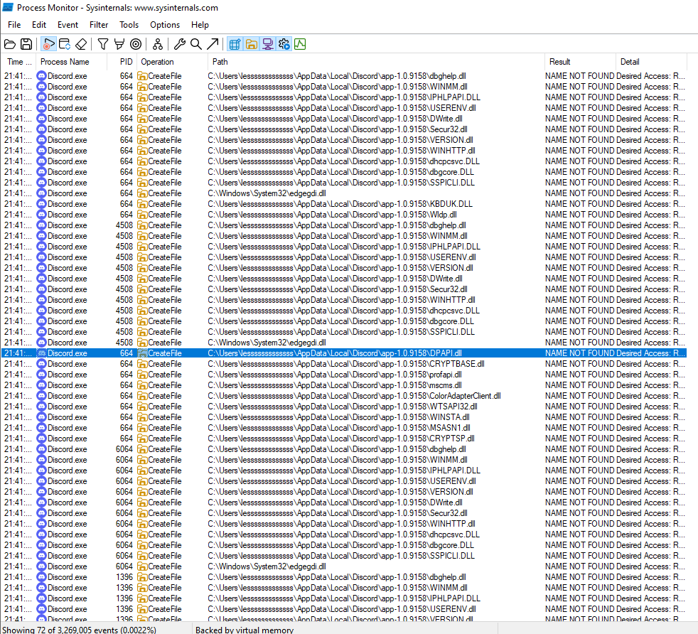
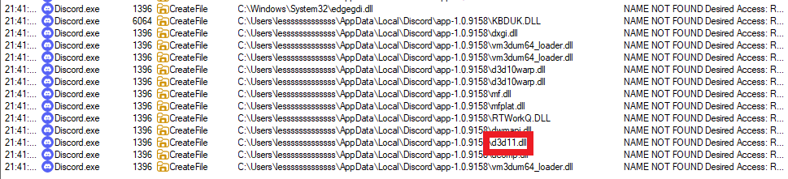
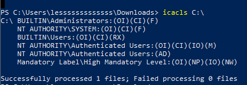
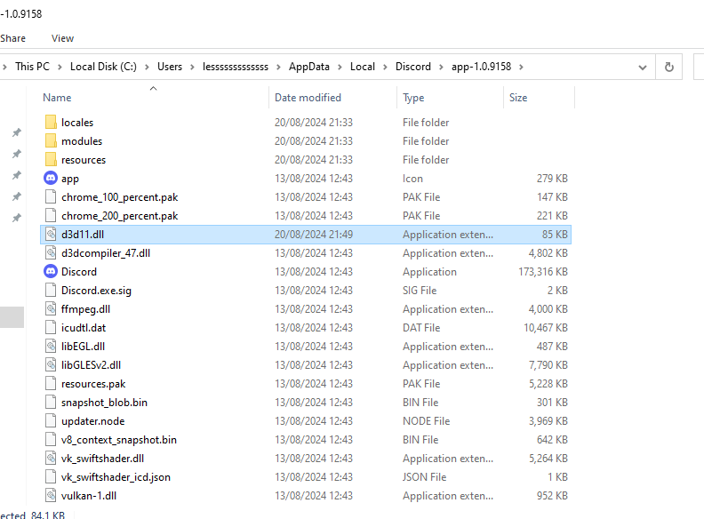

# Compilation

```bash
x86_64-w64-mingw32-gcc hack.c -shared -o output.dll
```
Rename `output.dll` to `d3d11.dll`. <br>
Put it in `C:\Users\<YOUR_USER_NAME>\AppData\Local\Discord\app-1.0.9158\`. <br>








---

# References
- Book - [Malware Development for Ethical Hackers: Learn how to develop various types of malware to strengthen cybersecurity](https://www.packtpub.com/en-us/product/malware-development-for-ethical-hackers-9781801810173) By
Zhassulan Zhussupov, 2024
- [Source code - hack.c](https://github.com/PacktPublishing/Malware-Development-for-Ethical-Hackers/blob/main/chapter04/03-dll-hijacking/hack.c)