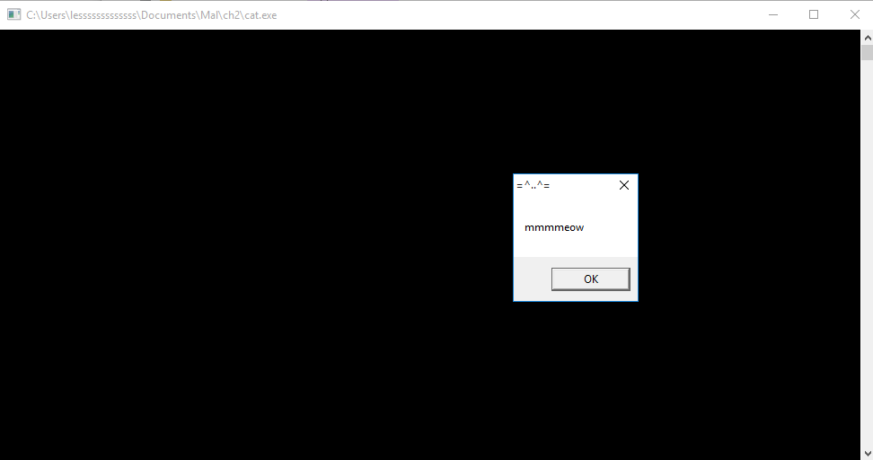
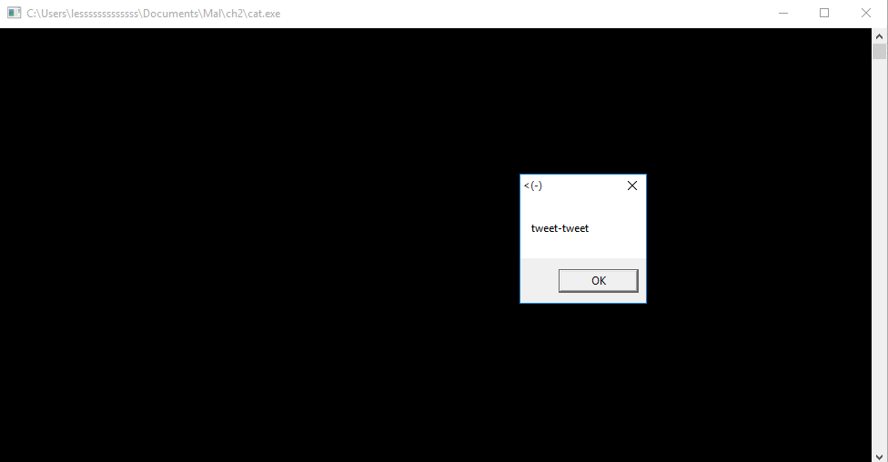
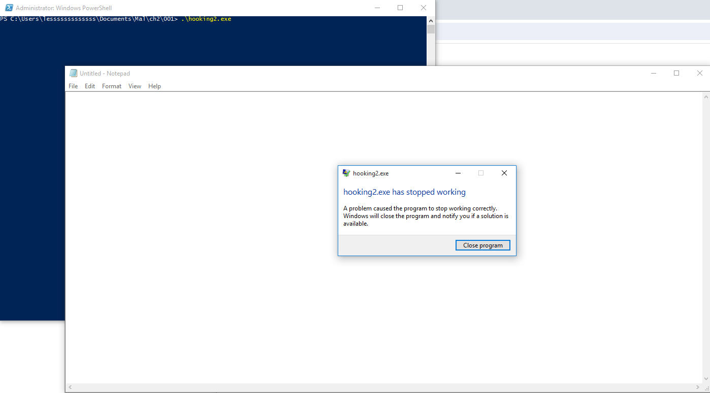
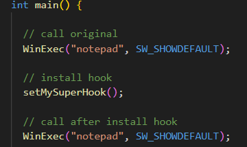

# API Hooking
`API hooking` is a technique used to manipulate and modify the functionality and sequence of `API calls`. This method is commonly employed by antivirus (AV) solutions to detect and analyze potentially malicious code. By intercepting `API calls`, AV software can monitor and control the behavior of applications, identifying suspicious or harmful activitie (Zhussupov, 2024).


# Step 1 - Run `cat.exe`
## 1. Compile `cat.c`
```bash
x86_64-w64-mingw32-g++ -O2 cat.c -o cat.exe -mconsole -I/usr/share/mingw-w64/include/ -s -ffunction-sections -fdata-sections -Wno-write-strings -fno-exceptions -fmerge-all-constants -static-libstdc++ -static-libgcc -fpermissive
```
## 2. Execute `cat.exe` in Windows 10 VM




# Step 2. Compile `pet.cpp`
```bash
x86_64-w64-mingw32-gcc -shared -o pet.dll pet.cpp -fpermissive
```

# Step 3. Compile `hack1.c`  (This doesn't work for me)
```bash
x86_64-w64-mingw32-g++ -O2 hack1.c -o hack1.exe -mconsole -I/usr/share/mingw-w64/include/ -s -ffunction-sections -fdata-sections -Wno-write-strings -fno-exceptions -fmerge-all-constants -static-libstdc++ -static-libgcc -fpermissive
```
Well... It didn't work as expected for me. I couldn't see the next messagebox jumping out and saying

# Step 2 - 
```bash
x86_64-w64-mingw32-g++ -O2 hooking.cpp -o hooking.exe -mconsole -I/usr/share/mingw-w64/include/ -s -ffunction-sections -fdata-sections -Wno-write-strings -fno-exceptions -fmerge-all-constants -static-libstdc++ -static-libgcc -fpermissive
```


`Notepad.exe` showed up, but I still have an error. 



---

# References
- cocomelonc (2021) https://cocomelonc.github.io/tutorial/2021/11/30/basic-hooking-1.html
- cocomelonc (2024) [Malware-Development-for-Ethical-Hackers/chapter02/03-apc-injection
](https://github.com/PacktPublishing/Malware-Development-for-Ethical-Hackers/blob/main/chapter02/03-apc-injection/hack2.c). GitHub Repository.
- Zhassulan Zhussupov (2024) Chapter 2: Exploring Various Malware Injection Attacks. [Malware Development for Ethical Hackers: Learn how to develop various types of malware to strengthen cybersecurity](https://www.packtpub.com/en-gb/product/malware-development-for-ethical-hackers-9781801810173)