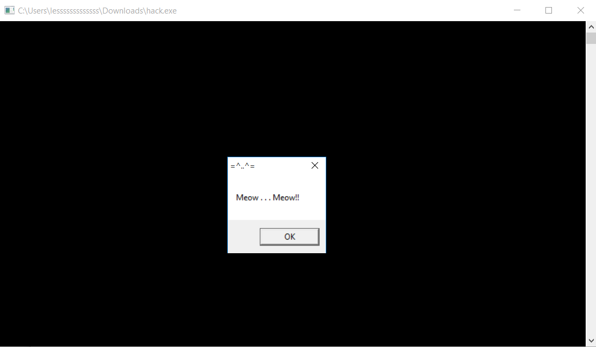
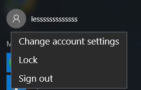
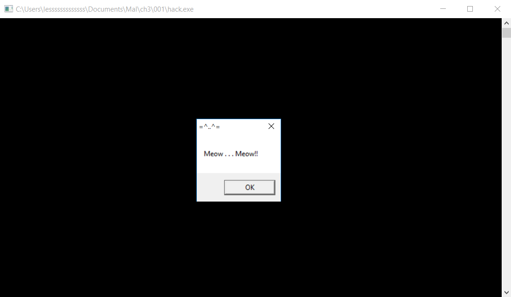
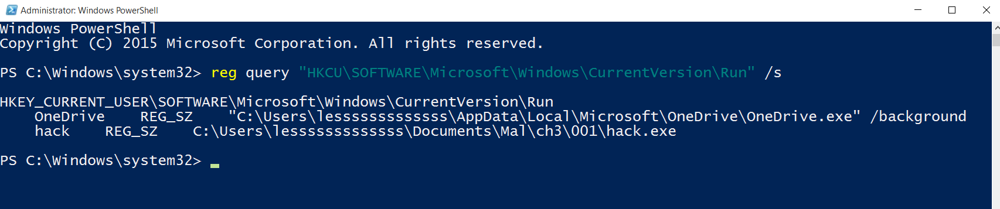
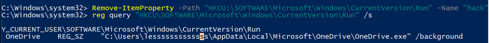

# Intro
In Windows operating systems, certain registry keys are used to automatically start programs when the system boots up or when a user logs in. These registry keys are referred to as `run keys` and `runonce keys`. By default, Windows systems generate and utilize the following run keys:

These registry keys are used to automatically start programs when the system boots or a user logs in:

### 1. `HKEY_CURRENT_USER\Software\Microsoft\Windows\CurrentVersion\Run`
- Runs programs at login for the current user, every time.
### 2. `HKEY_CURRENT_USER\Software\Microsoft\Windows\CurrentVersion\RunOnce`
- Runs programs at login for the current user, only once.
### 3. `HKEY_LOCAL_MACHINE\Software\Microsoft\Windows\CurrentVersion\Run`
- Runs programs at login for all users, every time.
### 4. `HKEY_LOCAL_MACHINE\Software\Microsoft\Windows\CurrentVersion\RunOnce`
- Runs programs at login for all users, only once.

These keys are used for starting essential applications but can also be exploited by malware

# Meow-ware
Compile `hack.c` with the following command:
```bash
x86_64-w64-mingw32-g++ -O2 hack .c -o hack.exe  -I/usr/share/mingw-w64/include/ -s -ffunction-sections -fdata-sections -Wno-write-strings -fno-exceptions -fmerge-all-constants -static-libstdc++ -static-libgcc -fpermissive
```
So far, this malware is only a meow-ware with a pop-up message box. <br>


# Step 1. Compile `pers.c`

```bash
x86_64-w64-mingw32-g++ -O2 pers.c -o pers.exe  -I/usr/share/mingw-w64/include/ -s -ffunction-sections -fdata-sections -Wno-write-strings -fno-exceptions -fmerge-all-constants -static-libstdc++ -static-libgcc -fpermissive
```
Then execute `pers.exe`:
```powershell
.\pers.exe
```
Then sign out the user, and login again. <br>
 <br>
After few seconds, you will see `hack.exe` jumping out. <br>


Now, if we use the command to see the regsitry:
```powershell
reg query "HKCU\SOFTWARE\Microsoft\Windows\CurrentVersion\Run" /s
```


The [author](https://cocomelonc.github.io/tutorial/2022/04/20/malware-pers-1.html) recommended to remove the created registry run key `hack`.
```powershell
Remove-ItemProperty -Path "HKCU:\SOFTWARE\Microsoft\Windows\CurrentVersion\Run" -Name "hack"
reg query "HKCU\SOFTWARE\Microsoft\Windows\CurrentVersion\Run" /s
```



---
# References
- [cocomelonc](https://cocomelonc.github.io/tutorial/2022/04/20/malware-pers-1.html) (2021) Malware development: persistence - part 1. Registry run keys. C++ example (blog). Available from: https://cocomelonc.github.io/tutorial/2022/04/20/malware-pers-1.html [Accessed 08 August 2024].