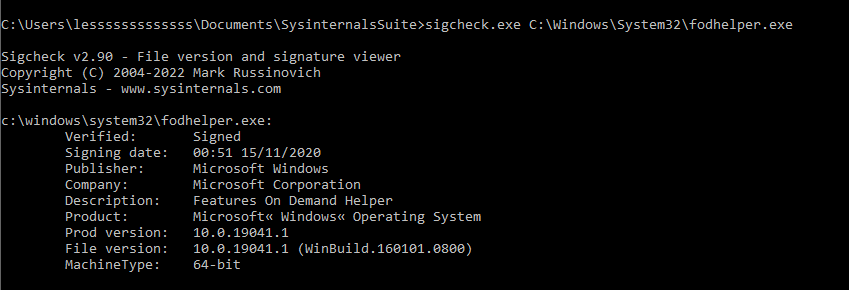
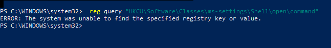
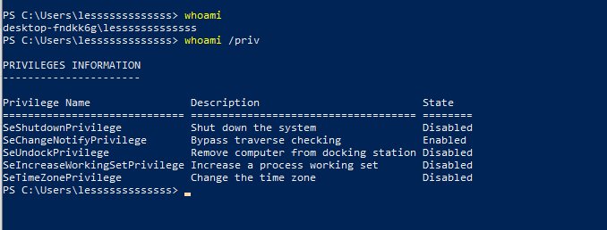
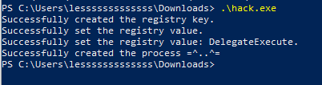
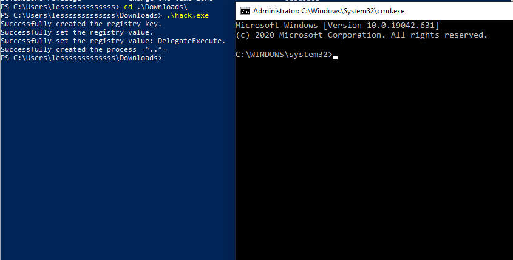
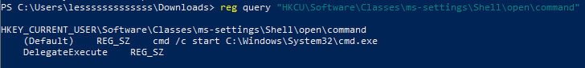
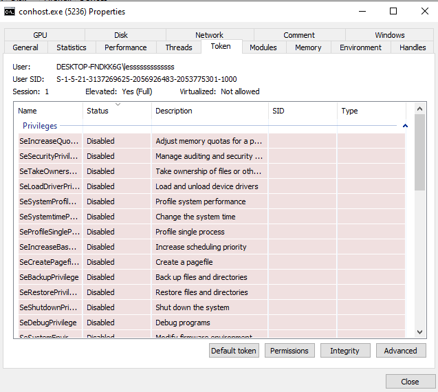

# Compile the code
```bash
x86_64-w64-mingw32-g++ -O2 hack.c -o hack.exe -I/usr/share/mingw-w64/include/ -s -ffunction-sections -fdata-sections -Wno-write-strings -fno-exceptions -fmerge-all-constants -static-libstdc++ -static-libgcc -fpermissive
```
 <br>

```
reg query "HKCU\Software\Classes\ms-settings\Shell\open\command"
```

```
whoami /priv
```
 <br>
 <br>

Execute `hack.exe`. <br>

 <br>
 <br>

Now, if we check the process hacker, we can see the poped `cmd.exe` is elevated. <br>
 <br>
 <br>

---
# References
- Book - [Malware Development for Ethical Hackers: Learn how to develop various types of malware to strengthen cybersecurity](https://www.packtpub.com/en-us/product/malware-development-for-ethical-hackers-9781801810173) By
Zhassulan Zhussupov, 2024
- [Source code - hack.c](https://github.com/PacktPublishing/Malware-Development-for-Ethical-Hackers/blob/main/chapter04/04-uac-bypass/hack.c)

- [MITRE ATT&CK - Privilege Escalation](https://attack.mitre.org/tactics/TA0004/)
