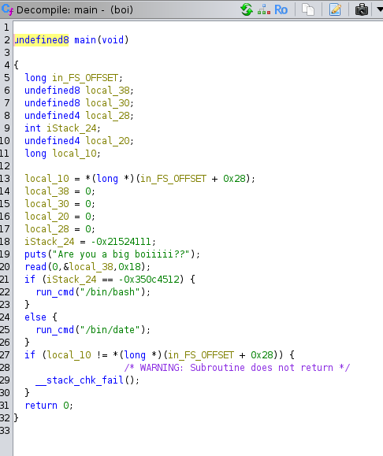

# Step 1

```bash
file boi
```
#### Result
```
boi: ELF 64-bit LSB executable, x86-64, version 1 (SYSV), dynamically linked, interpreter /lib64/ld-linux-x86-64.so.2, for GNU/Linux 2.6.32, BuildID[sha1]=1537584f3b2381e1b575a67cba5fbb87878f9711, not stripped
```



# References
- [Github repository - nightmare/modules/04-bof_variable
/csaw18_boi/](https://github.com/guyinatuxedo/nightmare/tree/master/modules/04-bof_variable/csaw18_boi) by guyinatuxedo.
- [Nightmare - Online Book](https://guyinatuxedo.github.io/01-intro_assembly/assembly/index.html) by guyinatuxedo.