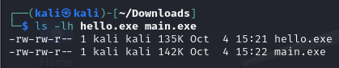
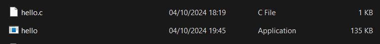
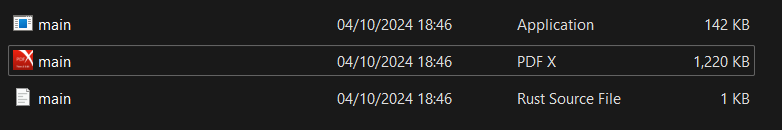
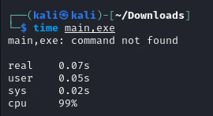
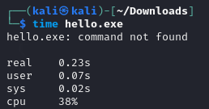

# Intro
I will use `Kali Linux` to compile C code with `Clang` & `LLVM`. <br>

### What's Clang?
`Clang` is the front-end that compiles C source code to `LLVM Intermediate Representation` **(IR)**, and LLVM handles the rest, including optimization and code generation.

# 1. Installation of LLVM & Clang
### Linux
In Linux, use this command to install `Clang` & `LLVM`. <br>
```bash
sudo apt-get install clang llvm
```

### Windows
You can find the instructions to get started with the LLVM system. <br>
- Go to the official LLVM releases page.
- Download the pre-built binary for Windows. Look for the "Windows (64-bit)" section and download the installer (usually named something like LLVM-x.x.x-win64.exe).

```
https://llvm.org/docs/GettingStarted.html#checkout
```

Verify the installation. <br>
```bash
clang --version
```

# 2. Execution files
Comparison of sizes. <br>


## C code - `hello.exe`
 <br>
### Size
The size is 135 KB. <br>
 <br>

## Rust code - `main.exe`
 <br>
### Size **(Larger)**
The size is 142 KB. <br>
 <br>

## Possible reasons
- `Rust executables` are often larger than C executables because Rust statically links many dependencies, including runtime libraries and memory safety mechanisms (like ownership, borrowing checks), which increases the file size.
- `C executables`, especially when linked dynamically, tend to be smaller because they rely on external libraries (like the C standard library) that aren’t included directly in the binary.


# 3. Comparison
## 3.1 Objdump
When working with object files without access to the source code, extracting as much information as possible is essential, particularly for debugging, reverse engineering, or system analysis (Geeksforgeeks, 2024).

`objdump` is primarily used to: <br>
- Disassemble machine code to examine low-level assembly instructions generated from source code.
- Analyse executable files to understand their structure, including sections, headers, and symbols.
- Inspect shared libraries for their symbol information and linking behaviour.
- Debug and reverse engineer binaries by analysing assembly code and related data. <br>

Inspect Executable Structure Using `objdump`, we can disassemble both Rust and C executables and analyse their **internal structure**. This can reveal differences in how the code is organized, function calls, symbols, etc. <br>


## Possible reasons for the results
- `Rust executables` will often have additional function calls related to memory management, thread safety, and panics.
- `C executables` will be leaner, with simpler system calls and memory management routines.

## 3.2 time
Based on the tutorial on Hostinger (2024), the default output of the built-in time command contains the following information: <br>

- `Real-time (real)`: The real-life time it takes for the process to run from start to finish. This includes any time taken by other processes and the time spent waiting for them to be complete.
- `User time (user).` The amount of CPU time spent in user mode during the process. Other processes and blocked time are not included.
- `System time (sys).` The total CPU time spent in kernel mode during the process. Similar to user time, other processes and time spent blocked by other processes are not counted.

### Rust code
- Quicker executing time <br>


### C code
- Slower executing time <br>


### Discussion
- Generally, Rust's executables have performance close to C, but Rust has extra overhead for runtime checks like safety, thread management, and memory handling. 
- In many cases, optimized Rust code (`cargo build --release`) performs similarly to optimized C code (`gcc -O3`). But this example tried to implement both executables using the same compiler `LLVM`, so wouldn't want to add more parameters in the command line.


# References
- [objdump(1) — Linux manual page](https://man7.org/linux/man-pages/man1/objdump.1.html)
- [GeeksforGeeks - Objdump Command in Linux with Examples](https://www.geeksforgeeks.org/objdump-command-in-linux-with-examples/)
- [Hostinger - Linux Time Command](https://www.hostinger.co.uk/tutorials/linux-time-command/)