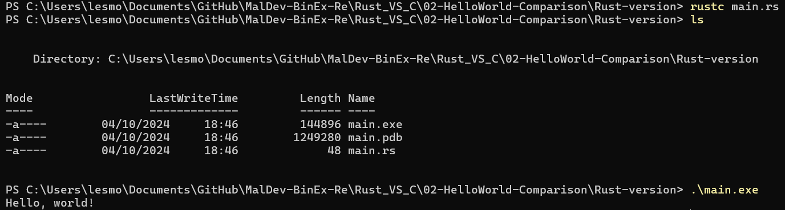

# Intro
I will use `Kali Linux` to compile C code with `Clang` & `LLVM`. <br>

### What's Clang?
`Clang` is the front-end that compiles C source code to `LLVM Intermediate Representation` **(IR)**, and LLVM handles the rest, including optimization and code generation.

# 1. Installation of LLVM & Clang
### Linux
In Linux, use this command to install `Clang` & `LLVM`. <br>
```bash
sudo apt-get install clang llvm
```

### Windows
You can find the instructions to get started with the LLVM system. <br>
- Go to the official LLVM releases page.
- Download the pre-built binary for Windows. Look for the "Windows (64-bit)" section and download the installer (usually named something like LLVM-x.x.x-win64.exe).

```
https://llvm.org/docs/GettingStarted.html#checkout
```

Verify the installation. <br>
```bash
clang --version
```

# 2. Execution files

### C code 


### Rust code


# 3. Comparison
## 3.1 Objdump
When working with object files without access to the source code, extracting as much information as possible is essential, particularly for debugging, reverse engineering, or system analysis (Geeksforgeeks, 2024).

`objdump` is primarily used to: <br>
- Disassemble machine code to examine low-level assembly instructions generated from source code.
- Analyse executable files to understand their structure, including sections, headers, and symbols.
- Inspect shared libraries for their symbol information and linking behaviour.
- Debug and reverse engineer binaries by analysing assembly code and related data. <br>


# References
- [objdump(1) — Linux manual page](https://man7.org/linux/man-pages/man1/objdump.1.html)
- [GeeksforGeeks - Objdump Command in Linux with Examples](https://www.geeksforgeeks.org/objdump-command-in-linux-with-examples/)